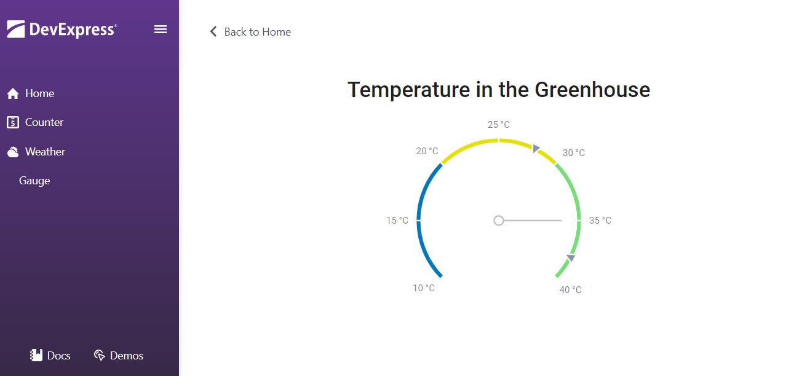

<!-- default badges list -->

[](https://supportcenter.devexpress.com/ticket/details/T1069428)
[](https://docs.devexpress.com/GeneralInformation/403183)
[](#does-this-example-address-your-development-requirementsobjectives)
<!-- default badges end -->
# Blazor - Use DevExtreme Circular Gauge in a Blazor Application

This example shows how you can embed [DevExtreme widgets](https://js.devexpress.com/Demos/WidgetsGallery/) into your Blazor application. You can use the same methods to integrate any JavaScript-based libraries.



## Implementation Details

The example solution contains **JSWidgetsRCL** and **DxtComponentsInBlazor** projects. The first project wraps the DevExtreme [Circular Gauge](https://js.devexpress.com/Demos/WidgetsGallery/Demo/Gauges/Overview/jQuery/Light/) widget.

_DevExtremeGauge.razor_ and _DevExtremeGauge.razor.js_ files store wrapper implementation. The widget also renders the **DevExtremeResources.razor** component. This component loads DevExtreme resources when you open a page with a DevExtreme component for the first time.

The **DxtGaugeInBlazor** project references **JSWidgetsRCL**. This allows you to use the wrapper as a regular Blazor component. The following code adds a `DevExtremeGauge` wrapper component:

```Razor
<DevExtremeGauge />
```

The DevExpress Blazor UI Component Library includes several DevExtreme-based components (for example, [DxHtmlEditor](https://docs.devexpress.com/Blazor/DevExpress.Blazor.DxHtmlEditor) or [DxMap](https://docs.devexpress.com/Blazor/DevExpress.Blazor.DxMap)). Refer to class descriptions for more information.

## Files to Review

* [DevExtremeResources.razor](./CS/DxtGaugeInBlazor/JSWidgetsRCL/DevExtremeComponents/DevExtremeResources.razor)  
* [DevExtremeResources.razor.js](./CS/DxtGaugeInBlazor/JSWidgetsRCL/DevExtremeComponents/DevExtremeResources.razor.js)  
* [DevExtremeGauge.razor](./CS/DxtGaugeInBlazor/JSWidgetsRCL/DevExtremeComponents/DevExtremeGauge.razor)  

## Documentation

[Add JavaScript-Based Components to an Application](https://docs.devexpress.com/Blazor/403578/common-concepts/add-js-components-to-application)
<!-- feedback -->
## Does this example address your development requirements/objectives?

[](https://www.devexpress.com/support/examples/survey.xml?utm_source=github&utm_campaign=blazor-use-devextreme-circular-gauge&~~~was_helpful=yes) [](https://www.devexpress.com/support/examples/survey.xml?utm_source=github&utm_campaign=blazor-use-devextreme-circular-gauge&~~~was_helpful=no)

(you will be redirected to DevExpress.com to submit your response)
<!-- feedback end -->
