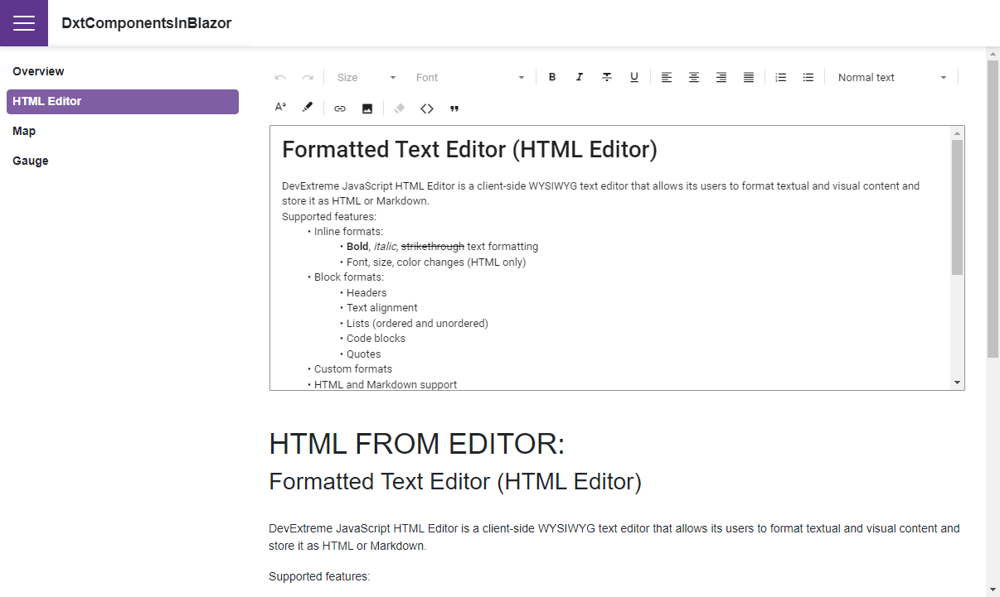

<!-- default badges list -->

[](https://supportcenter.devexpress.com/ticket/details/T1069428)
[](https://docs.devexpress.com/GeneralInformation/403183)
[](#does-this-example-address-your-development-requirementsobjectives)
<!-- default badges end -->
# Blazor - Use Gauges, HTML Editor, and Map in a Blazor Application

This example shows how you can embed [DevExtreme widgets](https://js.devexpress.com/Demos/WidgetsGallery/) into your Blazor application. You can use the same methods to integrate any JavaScript-based libraries.



## Implementation Details

The example solution contains **JSWidgetsRCL** and **DxtComponentsInBlazor** projects. The first project wraps the following DevExtreme widgets:

* [Gauge](https://js.devexpress.com/Demos/WidgetsGallery/Demo/Gauges/Overview/jQuery/Light/)
* [HTML Editor](https://js.devexpress.com/Demos/WidgetsGallery/Demo/HtmlEditor/Overview/jQuery/Light/)
* [Map](https://js.devexpress.com/Demos/WidgetsGallery/Demo/VectorMap/Overview/jQuery/Light/)

For each widget, _DevExtreme<WidgetName>.razor_ and _DevExtreme<WidgetName>.razor.js_ files store wrapper implementation. Look at _DevExtremeHtmlEditor.razor_ for an example on how to implement an event. The wrapper registers a [custom event handler](./CS/DxtComponentsInBlazor/JSWidgetsRCL/EventHandlers.cs), implements it on the [Blazor side](./CS/DxtComponentsInBlazor/JSWidgetsRCL/DevExtremeComponents/DevExtremeHtmlEditor.razor#L21) and maps it to the corresponding [DevExtreme event handler](./CS/DxtComponentsInBlazor/JSWidgetsRCL/DevExtremeComponents/DevExtremeHtmlEditor.razor.js#L7). You can implement other events in the same way.

Each widget also renders the **DevExtremeResources.razor** component. This component loads DevExtreme resources when you open a page with a DevExtreme component for the first time.

The **DxtComponentsInBlazor** project references **JSWidgetsRCL**. This allows you to use wrappers as regular Blazor components. The following code adds a `DevExtremeMap` wrapper component:


```Razor
<DevExtremeMap />
```

## Files to Review

* [DevExtremeResources.razor](./CS/DxtComponentsInBlazor/JSWidgetsRCL/DevExtremeComponents/DevExtremeResources.razor)  
* [DevExtremeResources.razor.js](./CS/DxtComponentsInBlazor/JSWidgetsRCL/DevExtremeComponents/DevExtremeResources.razor.js)  
* [DevExtremeHtmlEditor.razor](./CS/DxtComponentsInBlazor/JSWidgetsRCL/DevExtremeComponents/DevExtremeHtmlEditor.razor)  

## Documentation

[Add JavaScript-Based Components to an Application](https://docs.devexpress.com/Blazor/403578/common-concepts/add-js-components-to-application)
<!-- feedback -->
## Does this example address your development requirements/objectives?

[](https://www.devexpress.com/support/examples/survey.xml?utm_source=github&utm_campaign=blazor-use-devextreme-circular-gauge&~~~was_helpful=yes) [](https://www.devexpress.com/support/examples/survey.xml?utm_source=github&utm_campaign=blazor-use-devextreme-circular-gauge&~~~was_helpful=no)

(you will be redirected to DevExpress.com to submit your response)
<!-- feedback end -->
