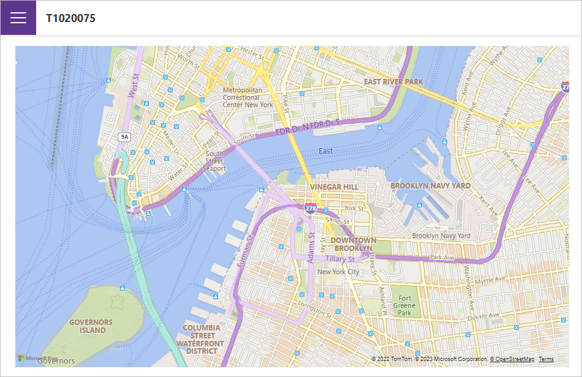

<!-- default badges list -->

<!-- default badges end -->
# Blazor - How to use DevExtreme maps in a Blazor application

This project demonstrates how to incorporate a [DevExtreme Map widget](https://js.devexpress.com/Documentation/Guide/UI_Components/Map/Overview/) in a Blazor application.

## Files to Review

- [Index.razor](./T1020075/T1020075/Pages/Index.razor)
- [_Layout.cshtml](./T1020075/T1020075/Pages/_Layout.cshtml)

## Documentation

- [Add DevExtreme Widgets to a Blazor Application](https://docs.devexpress.com/Blazor/403578/common-concepts/add-devextreme-widgets-to-application)

